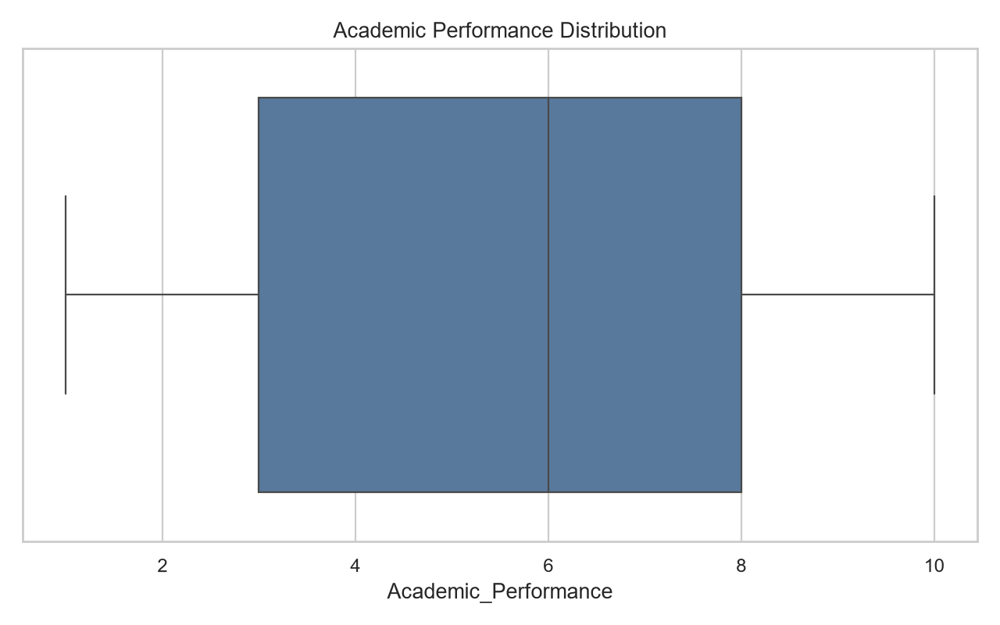
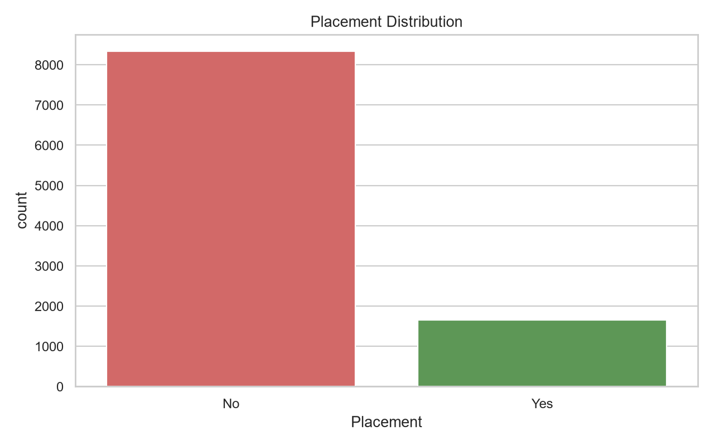
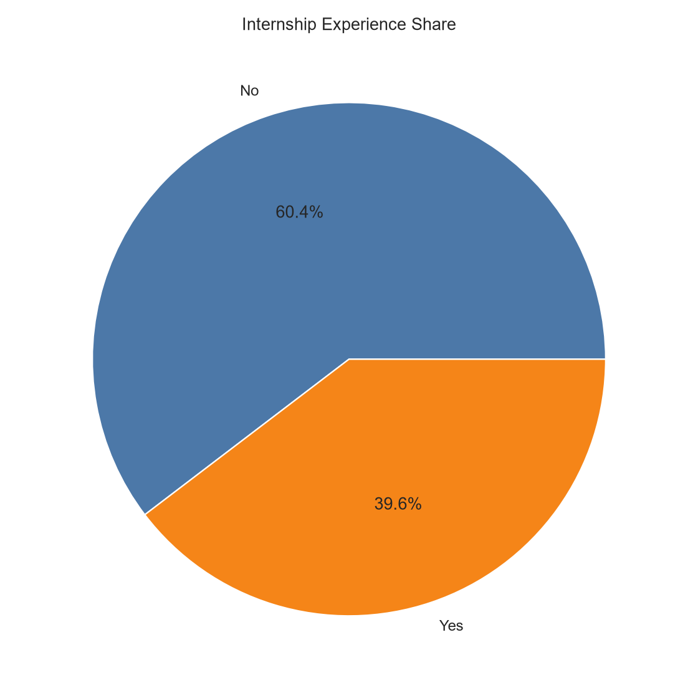
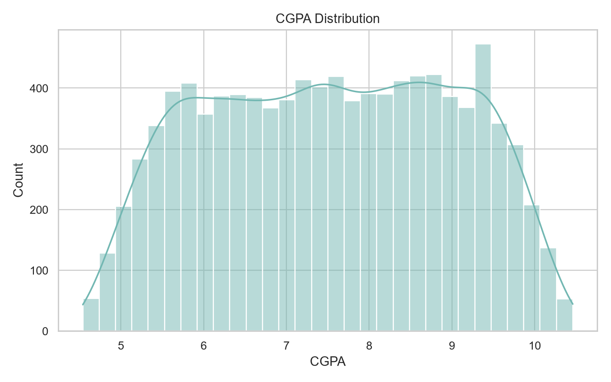
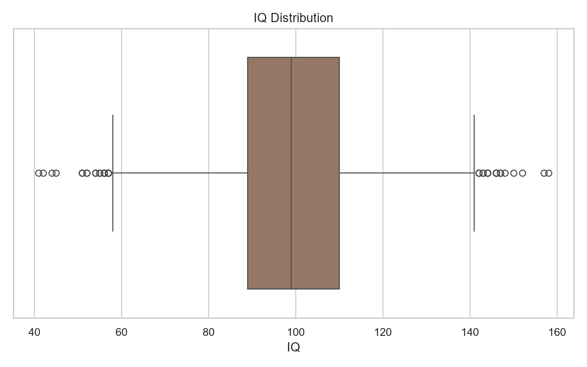
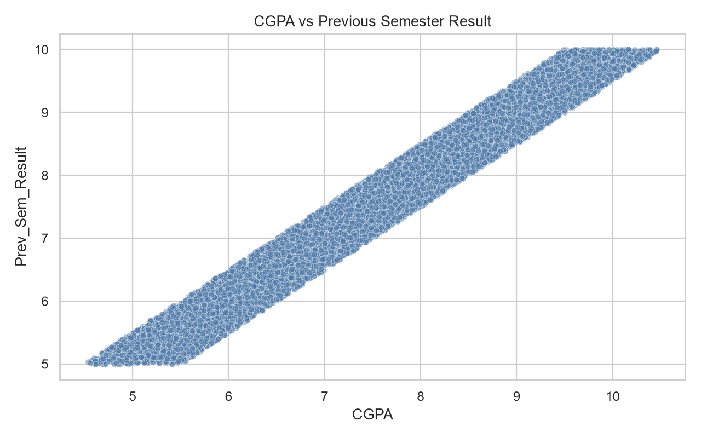
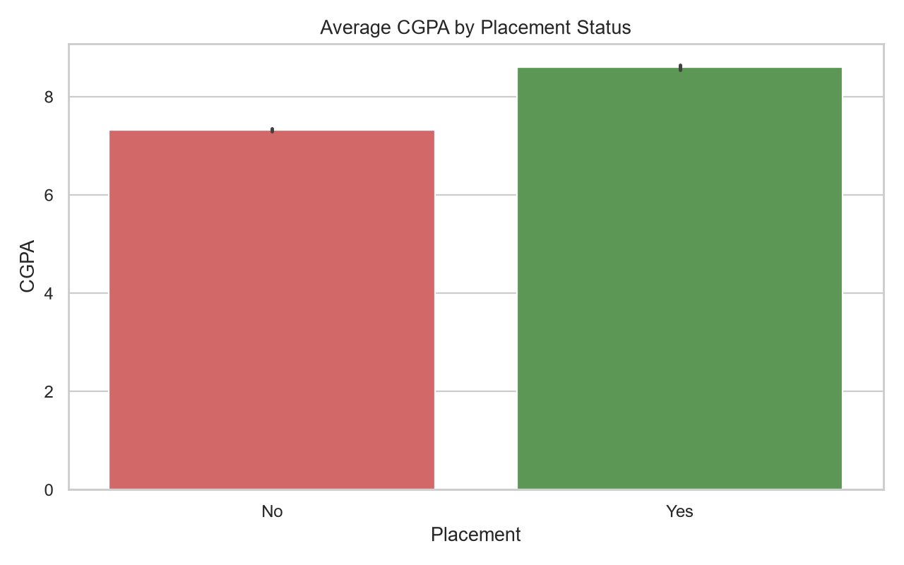
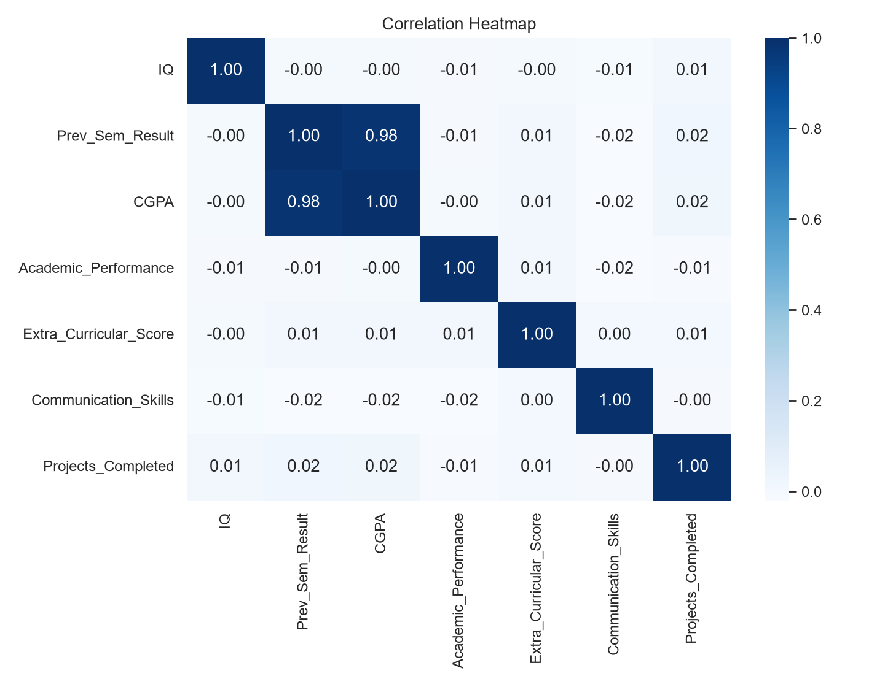
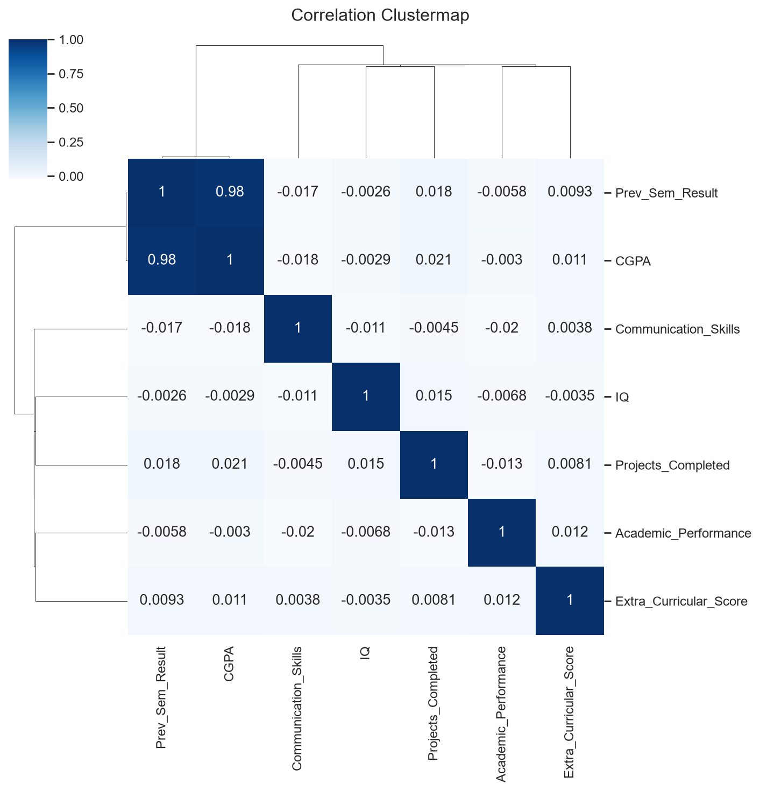

# College Student Placement EDA

This folder contains an exploratory data analysis (EDA) notebook for the `college_student_placement_dataset.csv` dataset. The analysis is documented in `EDA.ipynb` and the main charts are saved in the `plots/` folder for quick viewing in the README.

## Dataset Overview

The dataset includes student academic and profile features such as:

- College_ID
- IQ
- Prev_Sem_Result
- CGPA
- Academic_Performance
- Internship_Experience
- Extra_Curricular_Score
- Communication_Skills
- Projects_Completed
- Placement

## EDA Workflow

The notebook follows this sequence:

1. Import the core analysis libraries: pandas, numpy, matplotlib, and seaborn.
2. Load the placement dataset from CSV.
3. Inspect the data using shape, head, tail, sample rows, column names, and `info()`.
4. Review summary statistics with `describe()`.
5. Check distributions and potential outliers with boxplots.
6. Examine the target variable `Placement` with a countplot.
7. Explore categorical balance for `Internship_Experience` with a pie chart.
8. Visualize numeric distributions using histograms.
9. Compare academic features using scatter and bar plots.
10. Study feature relationships with a pairplot, correlation heatmap, and clustermap.

## Graphs

### Academic Performance

### Placement Distribution

### Internship Experience

### CGPA Distribution

### IQ Distribution

### CGPA vs Previous Semester Result

### Average CGPA by Placement Status

### Correlation Analysis

## Key Takeaways

- The target variable `Placement` is visibly imbalanced, so class balance should be considered in any downstream modeling.
- CGPA, previous semester result, and academic performance were analyzed together to understand how academic strength relates to placement.
- Correlation plots help highlight relationships among the numeric features and guide feature selection for future modeling.

## Files

- `EDA.ipynb` - notebook containing the full exploratory analysis.
- `college_student_placement_dataset.csv` - source dataset.
- `plots/` - exported charts used in this README.

## How to Reuse

Open `EDA.ipynb` in Jupyter or VS Code and run the cells to reproduce the analysis. The plots in `plots/` can also be reused in reports or presentations.
